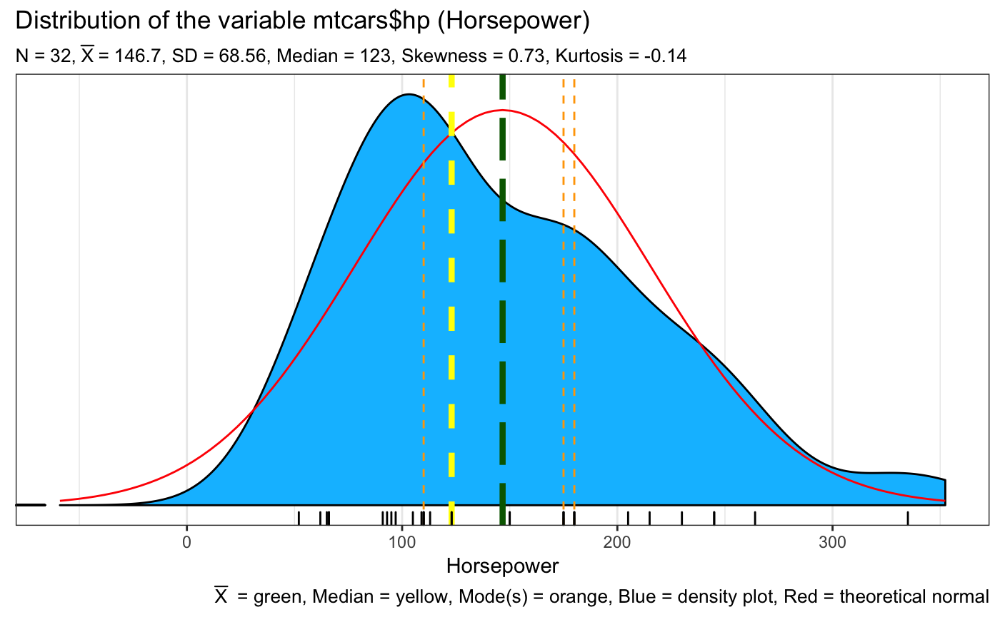
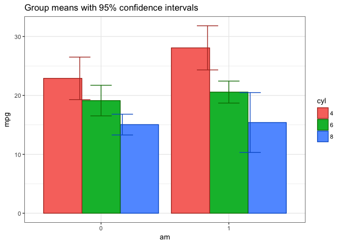

<!-- README.md is generated from this README.Rmd. Please edit the .rmd file not the .md file -->

[](http://CRAN.R-project.org/package=CGPfunctions)

<!--  #' tidyverse   -->

## Overview

A package that includes functions that I find useful for teaching
statistics as well as actually practicing the art. They typically are
not “new” methods but rather wrappers around either base R or other
packages and concepts I’m trying to master. Currently contains:

  - `Plot2WayANOVA` which as the name implies conducts a 2 way ANOVA and
    plots the results using `ggplot2`
  - `neweta` which is a helper function that appends the results of a
    Type II eta squared calculation onto a classic ANOVA table
  - `Mode` which finds the modal value in a vector of data
  - `SeeDist` which wraps around ggplot2 to provide visualizations of
    univariate data.

## Installation

``` r
# Install from CRAN
install.packages("CGPfunctions")

# Or the development version from GitHub
# install.packages("devtools")
devtools::install_github("ibecav/CGPfunctions")
```

## Usage

`library(CGPfunctions)` will load the package which contains 4
functions:

`SeeDist` will give you some plots of the distribution of a variable
using `ggplot2`

``` r
library(CGPfunctions)
SeeDist(mtcars$hp,whatvar="Horsepower",whatplots="d")
```

<!-- -->

    #>    Min. 1st Qu.  Median    Mean 3rd Qu.    Max. 
    #>    52.0    96.5   123.0   146.7   180.0   335.0

`Mode` is a helper function that simply returns one or more modal values

``` r
Mode(mtcars$hp)
#> [1] 110 175 180
```

`neweta` is a helper function which returns a tibble containing AOV
output similar to summary(aov(MyAOV)) but with eta squared computed and
appended as an additional column

``` r
MyAOV <- aov(mpg~am*cyl, mtcars)
neweta(MyAOV)
#> # A tibble: 4 x 8
#>   Source       Df `Sum Sq` `Mean Sq` `F value`       p sigstars `eta sq`
#>   <fct>     <int>    <dbl>     <dbl>     <dbl>   <dbl> <chr>       <dbl>
#> 1 am            1     37.0     37.0       4.30  0.0480 *          0.0330
#> 2 cyl           1    450.     450.       52.0   0.     ***        0.399 
#> 3 am:cyl        1     29.4     29.4       3.40  0.0760 .          0.0260
#> 4 Residuals    28    242.       8.64     NA    NA      <NA>       0.215
```

The `Plot2WayANOVA` function conducts a classic analysis using existing
R functions and packages in a sane and defensible manner not necessarily
in the one and only manner.

``` r
Plot2WayANOVA(mpg~am*cyl, mtcars)
#> 
#> Converting am to a factor --- check your results
#> 
#> Converting cyl to a factor --- check your results
#> 
#> You have an unbalanced design. Using Type II sum of squares, eta squared may not sum to 1.0
#> # A tibble: 4 x 8
#>   Source       Df `Sum Sq` `Mean Sq` `F value`       p sigstars `eta sq`
#>   <fct>     <int>    <dbl>     <dbl>     <dbl>   <dbl> <chr>       <dbl>
#> 1 am            1     36.8     36.8       4.00  0.0560 .          0.0330
#> 2 cyl           2    456.     228.       24.8   0.     ***        0.405 
#> 3 am:cyl        2     25.4     12.7       1.40  0.269  ""         0.0230
#> 4 Residuals    26    239.       9.19     NA    NA      <NA>       0.212
#> 
#> Table of group means
#> # A tibble: 6 x 9
#> # Groups:   am [2]
#>   am    cyl   TheMean TheSD TheSEM CIMuliplier LowerBound UpperBound     N
#>   <fct> <fct>   <dbl> <dbl>  <dbl>       <dbl>      <dbl>      <dbl> <int>
#> 1 0     4        22.9 1.45   0.839        4.30       19.3       26.5     3
#> 2 0     6        19.1 1.63   0.816        3.18       16.5       21.7     4
#> 3 0     8        15.0 2.77   0.801        2.20       13.3       16.8    12
#> 4 1     4        28.1 4.48   1.59         2.36       24.3       31.8     8
#> 5 1     6        20.6 0.751  0.433        4.30       18.7       22.4     3
#> 6 1     8        15.4 0.566  0.400       12.7        10.3       20.5     2
#> 
#> Testing Homogeneity of Variance with Brown-Forsythe
#>    *** Possible violation of the assumption ***
#> Levene's Test for Homogeneity of Variance (center = median)
#>       Df F value  Pr(>F)  
#> group  5   2.736 0.04086 *
#>       26                  
#> ---
#> Signif. codes:  0 '***' 0.001 '**' 0.01 '*' 0.05 '.' 0.1 ' ' 1
#> 
#> Testing Normality Assumption with Shapiro-Wilk
#> 
#>  Shapiro-Wilk normality test
#> 
#> data:  MyAOV_residuals
#> W = 0.96277, p-value = 0.3263
#> 
#> Interaction graph plotted...
```

<!-- -->

## Credits

Many thanks to Dani Navarro and the book \> ([Learning Statistics with
R](http://www.compcogscisydney.com/learning-statistics-with-r.html))
whose etaSquared function was the genesis of `neweta`.

“He who gives up safety for speed deserves neither.”
([via](https://twitter.com/hadleywickham/status/504368538874703872))

  - [stringr](https://github.com/tidyverse/stringr), for strings.
  - [lubridate](https://github.com/hadley/lubridate), for date/times.
  - [forcats](https://github.com/hadley/forcats), for factors.
  - [haven](https://github.com/hadley/haven), for SPSS, SAS and Stata
    files.
  - [readxl](https://github.com/hadley/readxl), for `.xls` and `.xlsx`
    files.
  - [modelr](https://github.com/hadley/modelr), for modelling within a
    pipeline
  - [broom](https://github.com/dgrtwo/broom), for turning models into
    tidy data
  - [ggplot2](http://ggplot2.tidyverse.org), for data visualisation.
  - [dplyr](http://dplyr.tidyverse.org), for data manipulation.
  - [tidyr](http://tidyr.tidyverse.org), for data tidying.
  - [readr](http://readr.tidyverse.org), for data import.
  - [purrr](http://purrr.tidyverse.org), for functional programming.
  - [tibble](http://tibble.tidyverse.org), for tibbles, a modern
    re-imagining of data frames.

## Leaving Feedback

If you like **CGPfunctions**, please consider leaving [feedback
here](https://github.com/ibecav/CGPfunctions/issues).

## Contributing

Contributions in the form of feedback, comments, code, and bug reports
are most welcome. How to contribute:

  - Issues, bug reports, and wish lists: [File a GitHub
    issue](https://github.com/ibecav/CGPfunctions/issues).
  - Contact the maintainer ibecav at gmail.com by email.
