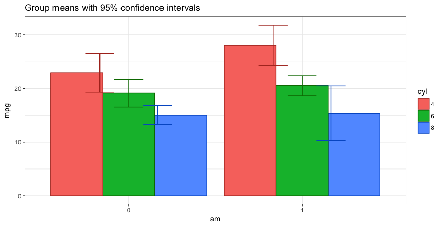
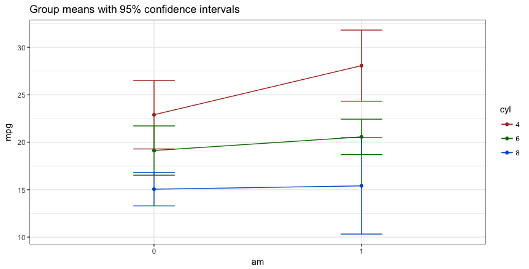

```{r setup, include = FALSE}
knitr::opts_chunk$set(
  collapse = TRUE,
  comment = "#>"
)
```


A package that includes functions that I find useful for teaching statistics as well as actually practicing the art.  They typically are not "new" methods but rather wrappers around either base R or other packages and concepts I'm trying to master.  Currently contains:

- `Plot2WayANOVA` which as the name implies conducts a 2 way ANOVA and plots the results using `ggplot2`
- `neweta` which is a helper function that appends the results of a Type II eta squared calculation onto a classic ANOVA table
- `Mode` which finds the modal value in a vector of data

## Vignette Info

The ANOVA family of statistical techniques that allow us to compare mean differences of one outcome (dependent) variable across two or more groups (levels) of one or independent variables (factor). It is also true that ANOVA is a special case of the GLM or regression models so as the number of levels increase it might make more sense to try one of those approaches.  The 2 Way ANOVA allows for comparisons of mean differences across 2 independent variables `factors` and varying numbers of levels.

The `Plot2WayANOVA` function conducts a classic analysis using existing R functions and packages in a sane and defensible manner not necessarily in the one and only manner.

## Scenario and data

Imagine that you are interested in understanding whether a car's fuel efficiency (mpg) varies based upon the type of transmission (automatic or manual) and the number of cylinders the engine has. Let's imagine that the `mtcars` data set is actually a random sample of 32 cars from different manufacturers and use the mean `mpg` by `am` and `cyl` to help inform our thinking.  While we expect variation across our sample we're interested in whether the differences between the means by grouping of transmission type and cylinders is significantly different than what we would expect in random variation across the data.  

In simplistic terms we want to know whether `am` matters, `cyl` matters or if it depends on the interaction of the two.  It's this interaction term that typically confuses novices or is difficult to "see".  That's where a good interaction graph can hopefully play a key role, and that's what the `Plot2WayANOVA` focuses on.

There's no lack or tools or capabilities in base R or in the many packages to do this task. What this function tries to do is pull together the disparate pieces with a set of sane defaults and a simple interface to work with it.  At its simplest you would require the library and then enter this command:

`Plot2WayANOVA(mpg~am*cyl, mtcars)` which lays our question out in R's vernacular with a formula and a dataframe.  Optionally we can specify a different confidence level and choose a line or a bar graph.

"Under the hood", however there's a lot of nice features at work.

1. Some basic error checking to ensure a valid formula and dataframe. The function accepts only a fully crossed formula to check for interaction term
1. It ensures the dependent (outcome) variable is numeric and that the two independent (predictor) variables already are or can be coerced to factors – the user is warned on the console if there are problems
1. A check is conducted to see if any of the variables of interest have missing cases – the user is warned on the console if there are problems
1. A summarized table of means, standard deviations, standard errors of the means, confidence intervals, and group sizes for each of the crossed combinations in our example that's 6 groupings 3 levels of cylinder and 2 levels of automatic or manual
1. In addition to the classic ANOVA table eta squared $\eta^2$ is calculated and appended as an additional column. If you're unfamiliar with them and want to know more especially where the numbers come from I recommend a good introductory stats text.  As noted earlier I recommend *Learning Statistics with R* [LSR](http://dj-navarro.appspot.com/lsr/lsr-0.5.1.pdf) see Table 14-1 on page 432. 
1. The Homogeneity of Variance assumption is tested with Brown-Forsythe
1. The normality assumption is tested with Shapiro-Wilk

## Example of using the function

`Plot2WayANOVA(mpg~am*cyl, mtcars)`

```{r echo=FALSE, message=FALSE, warning=FALSE, paged.print=FALSE}
xxx<-CGPfunctions::Plot2WayANOVA(mpg~am*cyl, mtcars)
```





## About the output

We can reject the null hypothesis at the $\alpha$ = 0.01 significance level (99% confidence). The F statistic is calculated as $$F = \frac{MS_{between}}{MS_{within}}$$ and the table gives us the precise p value and the common asterisks to show "success". 

In published results format that probably looks like "a Oneway ANOVA showed a significant effect for brand on tire mileage, F(3,56)=17.94, p<.01". In other words, we can reject the null hypothesis that these data came from brand tire populations where the average tire mileage life was the same!  Making it a prediction statement, we can see that brand type helps predict mileage life.

That's exciting news, but leaves us with some other unanswered questions. 

The data provide support for the hypothesis that the means aren't all equal -- that's called the omnibus test. We have support for rejecting $$\mu_{Apollo} = \mu_{Bridgestone} = \mu_{CEAT} = \mu_{Falken}$$ but at this point we can't state with any authority which specific pairs are different, all we can say is that at least one is different! When we look at the graph we made earlier we can guess we know but let's do better than that. How can we use confidence intervals to help us understand whether the data are indicating simple random variation or whether the underlying population is different.  We just need to compute the confidence interval for each brand's mean and then see which brand means lie inside or outside the confidence interval of the others. We would expect that if we ran our experiment 100 times with our sample size numbers for each brand the mileage mean would lie *inside* the upper and lower limit of our confidence interval 99 times (with $\alpha$ = 0.01) out of those 100 times.  If our data shows it outside the confidence interval that is evidence of a statistically significant difference for that specific pairing.

But we don't have to rely on our graph, we can be more precise and test it in a very controlled fashion.


## Credits

Many thanks to Dani Navarro and the book  > ([Learning Statistics with R](http://www.compcogscisydney.com/learning-statistics-with-r.html)) whose etaSquared function  was the genesis of `neweta`.


> "He who gives up [code] safety for [code] speed deserves neither."
([via](https://twitter.com/hadleywickham/status/504368538874703872))

